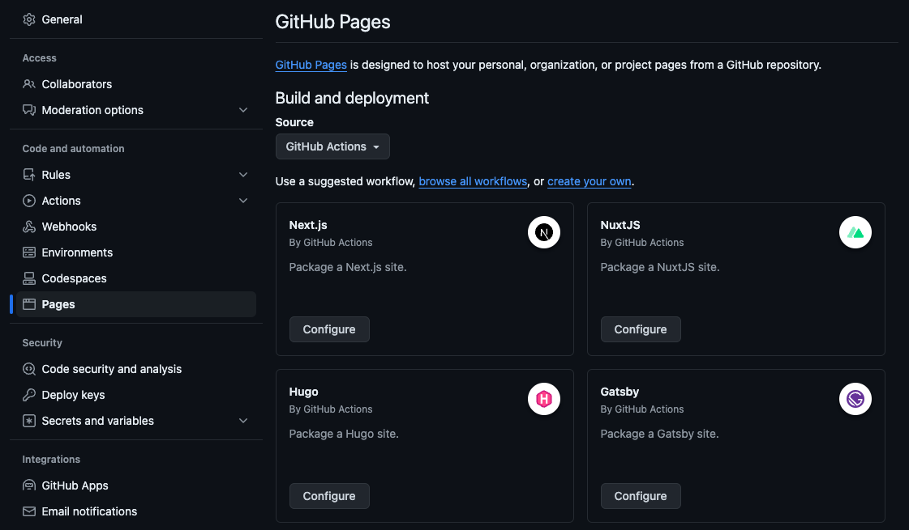
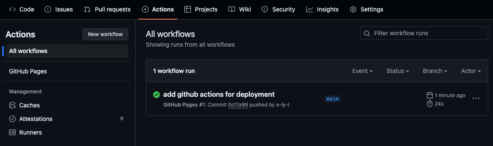
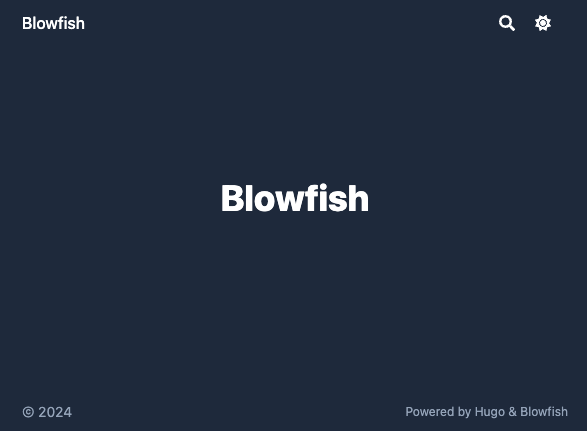

# Blowfish a Hugo blog on Github Pages

Hugo is a Static Site Generator framework.

Ok, then we start to implement.

# Prerequisite

Firstly, you need a Github

```
brew install go
brew install hugo

```

# Hugo with Blowfish theme

[Welcome to Blowfish! :tada:](https://blowfish.page/)

Setup with blowfish-tools

```
npm install -g blowfish-tools
blowfish-tools new <new_site_name>
```

# Deploy Github Pages with Github Actions

1. Create a new repository

<username>.github.io  


[gitignore.io](https://www.toptal.com/developers/gitignore)

```
#! .gitignore
### Hugo ###
# Generated files by hugo
/public/
/resources/_gen/
/assets/jsconfig.json
hugo_stats.json

# Executable may be added to repository
hugo.exe
hugo.darwin
hugo.linux

# Temporary lock file while building
/.hugo_build.lock

```

[GitHub Pages action - GitHub Marketplace](https://github.com/marketplace/actions/github-pages-action#%EF%B8%8F-set-runners-access-token-github_token)

```
#! .github/workflows/hugo.yml
name: GitHub Pages

on:
  push:
    branches:
      - main
  pull_request:

jobs:
  deploy:
    runs-on: ubuntu-22.04
    permissions:
      contents: write
    concurrency:
      group: ${{ github.workflow }}-${{ github.ref }}
    steps:
      - uses: actions/checkout@v3
        with:
          submodules: true  # Fetch Hugo themes (true OR recursive)
          fetch-depth: 0    # Fetch all history for .GitInfo and .Lastmod

      - name: Setup Hugo
        uses: peaceiris/actions-hugo@v2
        with:
          hugo-version: '0.110.0'

      - name: Build
        run: hugo --minify

      - name: Deploy
        uses: peaceiris/actions-gh-pages@v4
        if: github.ref == 'refs/heads/main'
        with:
          github_token: ${{ secrets.GITHUB_TOKEN }}
          publish_dir: ./public
          # publish_branch: gh-pages  # default


```

  


  
  
  


# Bonus


# **References**

-
