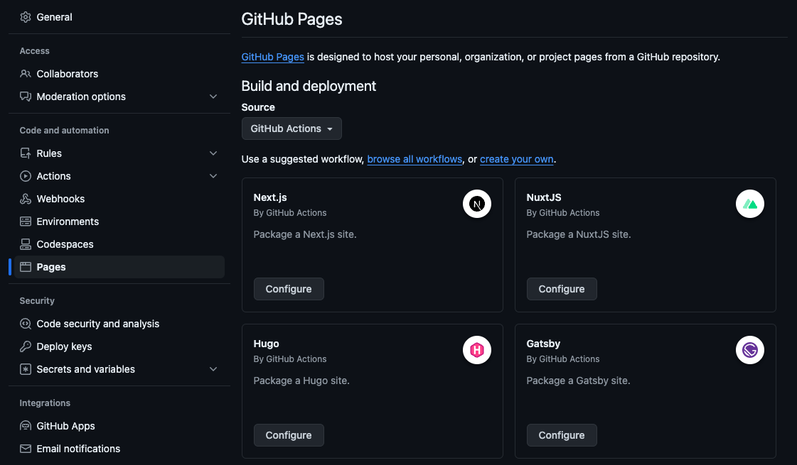
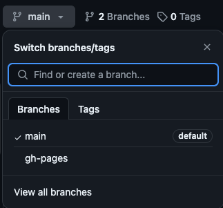
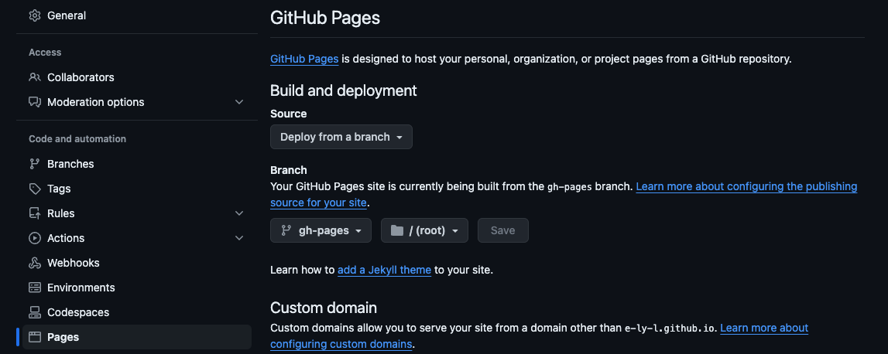
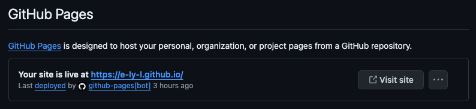
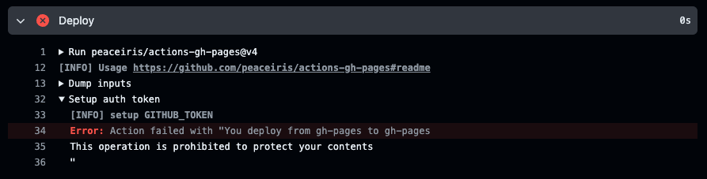

+++
title = "Blowfish a Hugo Blog and Deployed to Github Pages"
description = ""
summary = ""
date = 2024-06-22T14:30:00+08:00
slug = "blowfish-a-hugo-blog"
tags = ["Tech Blog","Hugo", "blowfish", "Github Pages", "Github Actions"]
categories = ["implement"]
+++

Since I started as an engineer, I heard many seniors say that the fastest way for an engineer to grow is by **writing a technical blog** and **doing side projects**.

Recently, the side projects I worked on with friends have gone live and started promotion, and I realized that I still didn't have a technical blog.

So, after doing some research, I decided to use the Hugo SSG framework.
Among its themes, I especially found Blowfish to be feature-complete and highly customizable, meeting my template needs for a technical blog.
Most importantly, it looks great.


> Look at the Blowfish logo, how cute it is~

Next, I started thinking about where to deploy it.
As a beginner, I wanted a platform that is (at least initially) free and preferably automates the deployment process as much as possible.
After some research, I found that Github Pages fits my initial needs well.
Since I'm building a technical blog, it makes sense to host it together with my Github projects.

Once the tech stack was decided, I started building.

## Prerequisites

The system needs to have Hugo installed, and since Hugo is written in Go, Go is also required.
If you want to use the Blowfish CLI tool later, Node.js is also needed.

```bash
brew install go
brew install hugo
brew install node
```

## Setting Up Hugo and Configuring the Blowfish Theme

According to the [Blowfish](https://blowfish.page/) official documentation, there are three main ways to set up Hugo and configure the theme.

1. Use Git Submodule to place Blowfish in the themes folder.
2. Use Hugo Module to install [Theme Components](https://gohugo.io/hugo-modules/theme-components/).
3. Manually download Blowfish source code from Github and place it in the themes folder. This is a very basic method.

In addition to these methods, Blowfish has a CLI tool called [blowfish-tools](https://github.com/nunocoracao/blowfish-tools) that can simplify the setup process. This is the recommended method by the official documentation.

After installing the tool, you can create a new project using the command.

```bash
npm install -g blowfish-tools
blowfish-tools new <new_site_name>
```

Now, navigate to the project directory and use the Hugo CLI to start a local server to preview the site.

```bash
cd <new_site_name>
hugo server
```

## Using Github Actions to Automatically Deploy to Github Pages

### Creating a Github Project

Since I am deploying to [Github Pages](https://pages.github.com/), there are two types of external links it provides.

1. If the repository name is set to `<username>.github.io`, the public URL will be `https://<username>.github.io/`.
2. If it is not the first type, the public URL will be `https://<username>.github.io/<repository>`.

I chose the first method.
After creating the Github project, you can push the project created with blowfish-tools to Github.

Note that if you used `hugo server` to preview the site locally, the project directory will include a `/public` folder containing the built static site. This folder does not need to be uploaded to Github.
You can set up `.gitignore` to avoid uploading it.
Below is a `.gitignore` file generated from [gitignore.io](https://www.toptal.com/developers/gitignore).

```bash
# .gitignore
### Hugo ###
# Generated files by hugo
/public/
/resources/_gen/
/assets/jsconfig.json
hugo_stats.json

# Executable may be added to repository
hugo.exe
hugo.darwin
hugo.linux

# Temporary lock file while building
/.hugo_build.lock
```

### Setting Up Github Actions

Go to the Settings page of the Github project and select Pages to see the Github Pages deployment settings.
Github Pages currently offers two automated deployment methods.

1. Use GitHub Actions
2. Deploy from a specific branch

If we choose **[Use GitHub Actions]**, we can see that it includes an official setup for Hugo automated deployment.


However, after looking at the [configuration file](https://github.com/actions/starter-workflows/blob/main/pages/hugo.yml), I found it not very elegant.
So I searched around and found a pre-made Github Actions tool [peaceiris/actions-gh-pages](https://github.com/peaceiris/actions-gh-pages).

Hmm, very elegant.


You can use its basic setup directly.
Here, I'll explain how it works, as I encountered some issues when I first used it (details in the final notes of this article).

When there is a commit push to `main`, the workflow triggers, including:

1. Specifying the machine (ubuntu-22.04) to execute the job
2. Setting up Hugo
3. Building the static site
4. Pushing the contents of the static site folder to a specific branch (default is `gh-pages`)

It's worth mentioning that since it will use a machine to build the site, you don't need to push the built files to Github.
The static site files will be placed in `/public`, and it **only pushes the contents of this folder to `gh-pages`**.
So after it runs, just set the Github Pages automated deployment to come from `gh-pages`.

```yaml
# .github/workflows/hugo.yml
name: GitHub Pages

on:
  push:
    branches:
      - main
  pull_request:

jobs:
  deploy:
    runs-on: ubuntu-22.04
    permissions:
      contents: write
    concurrency:
      group: ${{ github.workflow }}-${{ github.ref }}
    steps:
      - uses: actions/checkout@v3
        with:
          submodules: true # Fetch Hugo themes (true OR recursive)
          fetch-depth: 0 # Fetch all history for .GitInfo and .Lastmod

      - name: Setup Hugo
        uses: peaceiris/actions-hugo@v2
        with:
          hugo-version: "0.110.0"

      - name: Build
        run: hugo --minify

      - name: Deploy
        uses: peaceiris/actions-gh-pages@v4
        if: github.ref == 'refs/heads/main'
        with:
          github_token: ${{ secrets.GITHUB_TOKEN }}
          publish_dir: ./public
          # publish_branch: gh-pages  # default
```

Add this configuration file to the project and push it to Github. Then, go to the Actions page of the Github project to see it running.


After it runs, go back to the Code page and check the branches, you will see a `gh-pages` branch.


### Setting Up Github Pages

Go to the Settings page and click Pages, then set the automated deployment to **[Deploy from a specific branch]**.

After setting it up, go back to Actions and you will see it running the deployment.
  
Once the deployment is finished, go to Pages, and it will show that it has been deployed to an external URL.

Visit the external URL, and it will be live.


With this, we have completed the automated deployment of the blog. From now on, just push to Github, and the blog will automatically update~

## References

- [Build your homepage using Blowfish and Hugo](https://n9o.xyz/posts/202310-blowfish-tutorial/)

  - A very detailed guide on how to set up a blowfish project and initial configuration, also using [peaceiris/actions-gh-pages](https://github.com/peaceiris/actions-gh-pages), but deploying to Firebase.

- [Hugo 搭配 Github Actions 實現自動化部屬(二)](https://josh-ku.com/post/hugo-install-p2/)
  - Advanced usage of [peaceiris/actions-gh-pages](https://github.com/peaceiris/actions-gh-pages), pushing to another GitHub repository and directly deploying from the master branch to GitHub Pages.
  - Uses Cloudflare for domain binding.

## Sidebar

When I first set up [peaceiris/actions-gh-pages](https://github.com/peaceiris/actions-gh-pages), I misunderstood the deployment to GitHub Pages, thinking it needed to be set to deploy from the `gh-pages` branch.
I initially thought there was an issue with the `github_token` section, as the official documentation mentioned setting up some things for the [first deployment](https://github.com/peaceiris/actions-gh-pages?tab=readme-ov-file#%EF%B8%8F-first-deployment-with-github_token). Therefore, I thought I needed to first push to GitHub from the `gh-pages` branch to establish permissions.

So, I created a branch named `gh-pages` and changed the branch in the configuration file from `main` to `gh-pages` for testing purposes.
As expected, an unexpected error message appeared, which puzzled me at first glance.


It wasn't until I carefully read through the official documentation and saw that `publish_branch` could be configured, with its default value being `gh-pages`, that I understood what was happening.
My immediate reaction was like...

