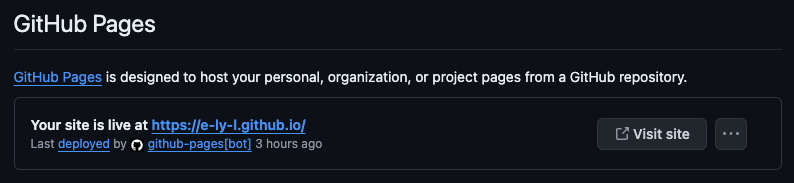

+++
title = "Blowfish 一個 Hugo 部落格並放到 Github Pages "
description = ""
summary = ""
date = 2024-06-22T14:30:00+08:00
slug = "blowfish-a-hugo-blog"
tags = ["Tech Blog","Hugo", "blowfish", "Github Pages", "Github Actions"]
categories = ["implement"]
+++

我從剛開始當工程師不久，就聽到很多前輩說，工程師成長最快的方式就是 **寫技術部落格** 和 **做 Side-Project** 。

而最近和朋友寫的 Side-Project 都已經上線、開始做推廣了，才想到我好像還沒有技術部落格。

於是在做了一番研究後，決定使用 Hugo 這個 SSG 框架。
而在他的主題中尤其覺得 Blowfish 功能完整、可以設定的部分很多，符合我對於技術部落格的樣板需求。
重點是很好看。


看看 Blowfish 的 logo，多麽可愛啊～

接著，我就開始思考要部署到哪個地方會比較適合。
對於剛剛開始的我來說，我希望這個平台是（起碼初期）免費，且最好部署上去的過程可以盡量自動化。
一樣做了一些研究後，覺得 Github Pages 很符合我的初期使用。
畢竟我是要搭建技術部落格的，那把它跟我的 Github 放在一起，我覺得沒毛病。

既然決定好了技術棧，那就開始搭建吧。

## 前置需求

系統要安裝 Hugo, 而因為 Hugo 是用 Go 寫的，所以也要有 Go。
而後面如果要使用 Blowfish 的 CLI 工具的話則需要有 node。

```bash
brew install go
brew install hugo
brew install node
```

## 建立 Hugo 以及設定 Blowfish 主題

按照 [Blowfish](https://blowfish.page/) 的官方文件，建立 Hugo 並設定主題有主要 3 種方法。

1. 使用 Git Submodule 的方式把 Blowfish 放到 themes 的資料夾下面。
2. 使用 Hugo Module 安裝 [Theme Components](https://gohugo.io/hugo-modules/theme-components/) 的方式。
3. 手動下載 Github 上的 Blowfish 原始碼，然後一樣放到 themes。 非常土炮的方法。

而除了這幾種方法外， Blowfish 有個叫 [blowfish-tools](https://github.com/nunocoracao/blowfish-tools) 的 CLI 工具，可以非常簡單的完成設定，這也是官方推薦使用的方式。

安裝完工具後，就可以透過指令來建立一個專案囉。

```bash
npm install -g blowfish-tools
blowfish-tools new <new_site_name>
```

現在進到專案裡，使用 Hugo CLI 在本地起一個網頁看一下樣子。

```bash
cd <new_site_name>
hugo server
```

## 使用 Github Actions 自動部署到 Github Pages

### 建立 Github 專案

由於我是要部署到 [Github Pages](https://pages.github.com/)，而目前其提供的外部連結有 2 種。

1. 如果設定 Repository 的名稱為 `<username>.github.io`， 則後續的公開位置則會是 `https://<username>.github.io/` 。
2. 如果不是第一種的話，則後續的公開位置則會是 `https://<username>.github.io/<repository>`

我在這邊是選擇用第一種方法。
建立完 Github 專案後，現在就可以先把剛才用 blowfish-tools 建立好的專案推到 Github 上囉。

注意，如果剛才有使用 `hugo server` 在本地預覽網頁的話，此時的專案資料夾內會包含 `/public` 的資料夾，裡面是打包好的靜態網頁，而這個不需要上傳到 Github。
可以設定 `.gitignore` 去避免上傳。
下面是從 [gitignore.io](https://www.toptal.com/developers/gitignore) 建立的 gitignore 檔案。

```bash
# .gitignore
### Hugo ###
# Generated files by hugo
/public/
/resources/_gen/
/assets/jsconfig.json
hugo_stats.json

# Executable may be added to repository
hugo.exe
hugo.darwin
hugo.linux

# Temporary lock file while building
/.hugo_build.lock
```

### 設定 Github Actions

進到剛才建立的 Github 專案，可以到 Settings 的頁面後點選 Pages 看到 Github Pages 的部署設定。
Github Pages 目前提供 2 種自動化部署方式。

1. 使用 GitHub Actions
2. 從特定分支部署

而如果我們選擇 **[使用 GitHub Actions]** 的話，可以看到其中包含 Hugo 自動化部署的的官方設定。


但看了一下，[設定檔](https://github.com/actions/starter-workflows/blob/main/pages/hugo.yml)的內容，覺得不夠優雅。
所以搜尋了一下，找到一個別人寫好的 Github Actions 工具 [peaceiris/actions-gh-pages](https://github.com/peaceiris/actions-gh-pages)。

嗯，非常優雅。


可以直接使用他的基本設置。
這邊來講一下他的實作方法，畢竟我一開始用的時候也是遇到一些狀況(詳見本文最後的題外話)。

在有 commit push 到 `main` 的時候觸發工作流程，其包含:

1. 指定機器(ubuntu-22.04)執行工作
2. 設定 Hugo
3. 打包成靜態網站
4. 把靜態網站的資料夾內容推到特定分支(預設為 `gh-pages`)

值得說的是，因為他會開一台機器去打包，因此不需要把打包的資料推到 Github 上。
而靜態網站的資料會放在 `/public` ，而他也 **只會把這個資料夾內的資料推到 `gh-pages`** 。
所以當他執行完後，只要把 Github Pages 的自動化部署設定成來自 `gh-pages` 就可以了。

```yaml
# .github/workflows/hugo.yml
name: GitHub Pages

on:
  push:
    branches:
      - main
  pull_request:

jobs:
  deploy:
    runs-on: ubuntu-22.04
    permissions:
      contents: write
    concurrency:
      group: ${{ github.workflow }}-${{ github.ref }}
    steps:
      - uses: actions/checkout@v3
        with:
          submodules: true # Fetch Hugo themes (true OR recursive)
          fetch-depth: 0 # Fetch all history for .GitInfo and .Lastmod

      - name: Setup Hugo
        uses: peaceiris/actions-hugo@v2
        with:
          hugo-version: "0.110.0"

      - name: Build
        run: hugo --minify

      - name: Deploy
        uses: peaceiris/actions-gh-pages@v4
        if: github.ref == 'refs/heads/main'
        with:
          github_token: ${{ secrets.GITHUB_TOKEN }}
          publish_dir: ./public
          # publish_branch: gh-pages  # default
```

把這個設定檔加入專案裡然後推到 Github ，這時候我們到 Github 專案頁面的 Actions 就可以看到他在執行了。


執行完再回到 Code 的地方，看一下分支，果然多了 `gh-pages` 。


### 設定 Github Pages

到 Settings 頁面點 Pages ，並設定自動化流程為 **[從特定分支部署]** 。

設定完後，再次到 Actions 看，他就已經在跑部署了。
  
等上面的部署跑完，再次到 Pages 看，會顯示已經部署到外部位址了。

連到外部位址，果然出現了。


這樣我們就完成部落格的自動化部署啦，以後只要推到 Github ，部落格就會自動更新囉～

## 參考資料

- [Build your homepage using Blowfish and Hugo](https://n9o.xyz/posts/202310-blowfish-tutorial/)

  - 非常詳細地講解如何建立 blowfish 專案以及初步設定，同樣使用 [peaceiris/actions-gh-pages](https://github.com/peaceiris/actions-gh-pages) ，不過他是部署到 firebase 上。

- [Hugo 搭配 Github Actions 實現自動化部屬(二)](https://josh-ku.com/post/hugo-install-p2/)
  - [peaceiris/actions-gh-pages](https://github.com/peaceiris/actions-gh-pages) 的進階使用，推到另一個 Github Repository 並直接從分支 master 部署到 Github Pages。
  - 使用 Cloudflare 綁網域

## 題外話

我最開始在設定 [peaceiris/actions-gh-pages](https://github.com/peaceiris/actions-gh-pages) 時候，沒搞懂 Github Pages 那邊要設定成從分支 `gh-pages`部署。
一直以為是 `github_token` 那段有問題，官方文件右說第一次部署時要[設定一些東西](https://github.com/peaceiris/actions-gh-pages?tab=readme-ov-file#%EF%B8%8F-first-deployment-with-github_token)，所以我以為要先在 gh-pages 的分支上推到 Github 去建立權限。

所以我就開了一個分支叫 `gh-pages`，並且把設定檔裡的分支從 `main` 改成 `gh-pages` 好做測試。
而他果然不出意外就要出意外地出現以下錯誤訊息，當下看到時還一度很不解。


直到認真把官方文件看完，看到他可以設定 `publish_branch` ，而且它的預設值是 `gh-pages` 時才搞懂發生什麼事。
我當下的感覺就是...

