+++
title = "Publish a Static Website on CloudFlare Pages with Custom Domain"
description = ""
summary = ""
date = 2024-07-04T23:30:00+08:00
slug = "publish-a-static-website-on-cloudflare-pages"
tags = ["Tech Blog", "Cloudflare Pages", "Cloudflare Domains", "Google Search Engine"]
categories = ["implement"]
+++

As a follow-up to [my last post](../blowfish-a-hugo-blog), I will be moving my tech blog (the one you’re reading now) to CloudFlare Pages with a custom domain that I bought on CloudFlare Domains.

## TL; DR

Start with [Cloudflare Domains](./#cloudflare-domains). If you just want to know how to put a static website on [Cloudflare Pages](./#cloudflare-pages), then start here.

## Preface

It might seem confusing since I previously mentioned wanting to keep things simple and low-cost (free). So why am I changing the platform from GitHub Pages to CloudFlare Pages (which is also free) with a custom domain (which costs)? There are two main reasons.

### **Reason 1: The Difference in Names**

GitHub Pages publishes the URL based on the account’s username. My username is an extreme abbreviation of my name, which I like for its abstraction. However, over time, I wanted to give the blog a proper name. There’s a gap between the username and the blog name.

### **Reason 2: Insight from Website Analytics**

After publishing the blog on GitHub Pages, I added Google Analytics to check the visitors and found that the only visitor was myself.

  
Sorry for being self-righteous.

Wait, that’s not the whole story! I also put my blog on Google Search Console. The key issue is visibility. Some search engine scrapers should visit my website to index it for better search results. Google Analytics might exclude robots, but the signals of other similar services should able be extract . However, there were no such visits.  
Based on these two reasons, I decided to register a domain and connect it to my blog.

## Let's Do It

### Cloudflare Domains

Before choosing Cloudflare, I compared prices from several domain registrars. Cloudflare provided the best value. I’ll list all the prices I found at the end of this article. Note that prices change frequently, so compare them before buying a domain.

Register a Cloudflare account, go to Domain Registration, enter your desired domain name, and if the price is acceptable, prepare your credit card to register it.

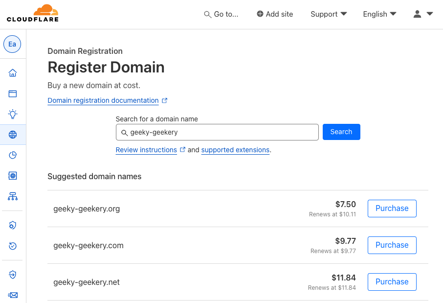

After purchasing it, go to Webpages, where you can find the domain you just bought.  
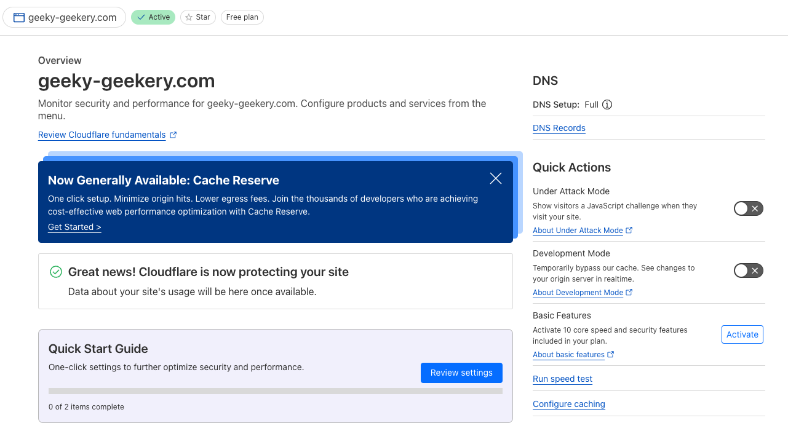

### Cloudflare Pages

Now that we have the domain, we can connect our blog to it. This time, I’ll use the blog I created in the [last post](../blowfish-a-hugo-blog), which is already automated into a static website. Go to Workers & Pages and choose Connect to Git. Alternatively, you can choose Upload Assets to manually upload the static files.  
If you want to automate (CI/CD) the deployment workflow for future modifications, I suggest connecting to Git like I did.  
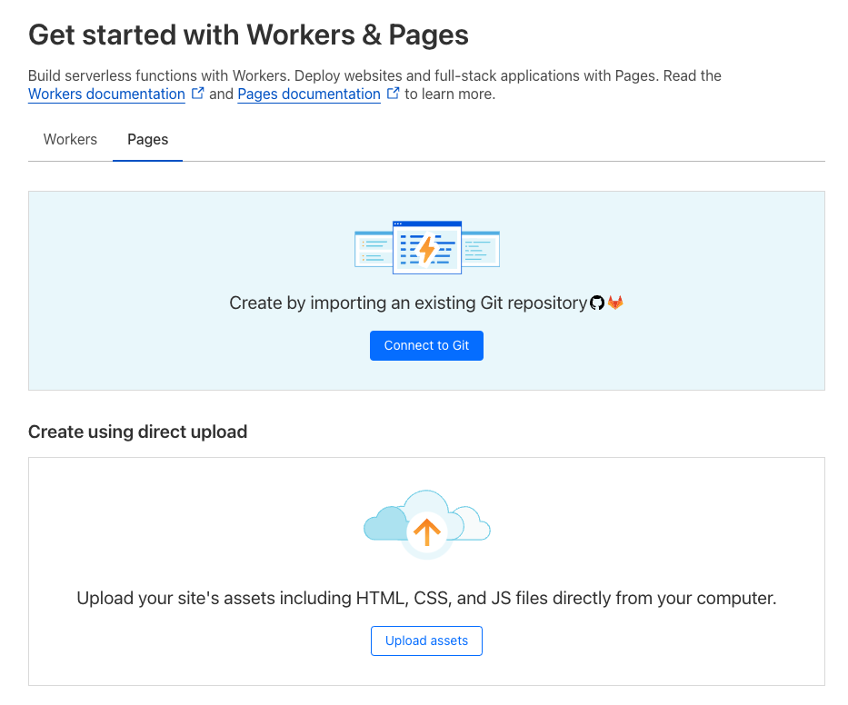
Connect to our GitHub account and select the repository we want to publish.  
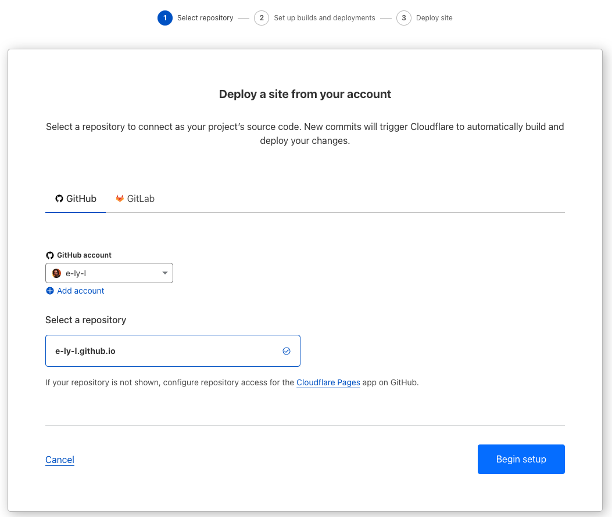
Choose the branch we want to automatically deploy in the future.  
Ensure we finish the build of the website, as mentioned in the [last post](../blowfish-a-hugo-blog), or we will need to complete the Build settings.  
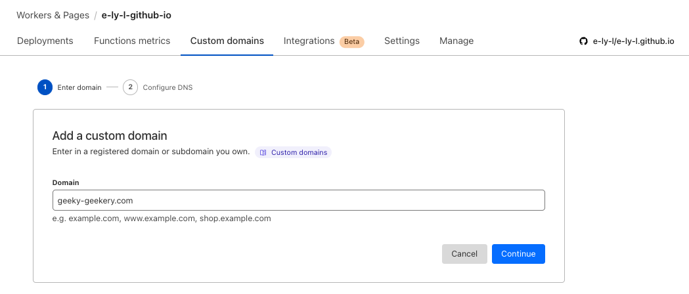
It will start to deploy. Once finished, it will look like this:  
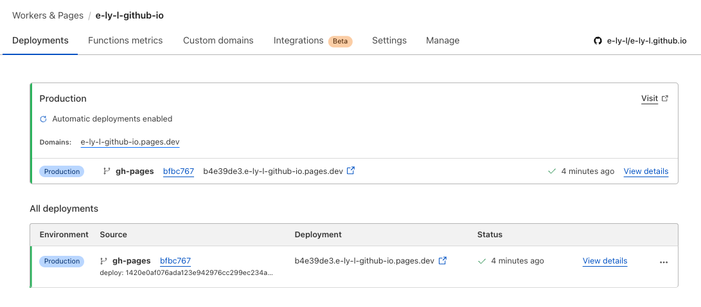
Now we can connect the website to the domain we just bought.  
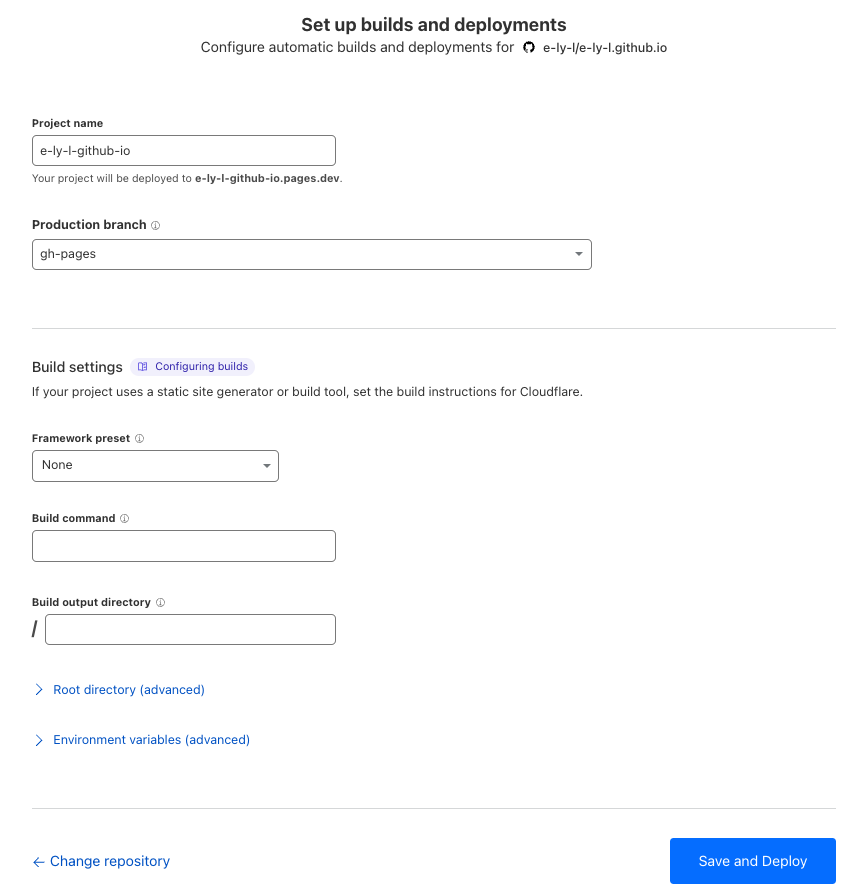

Keep clicking next.  
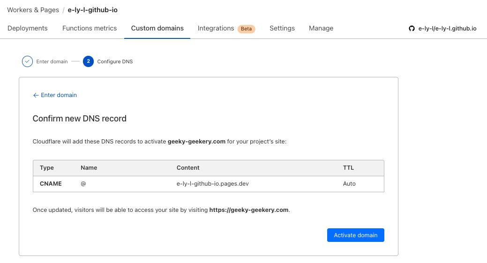
It will start configuring DNS, SSL, etc.  
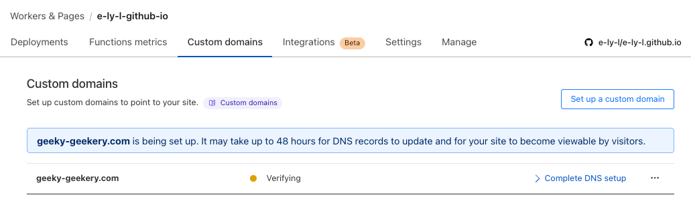
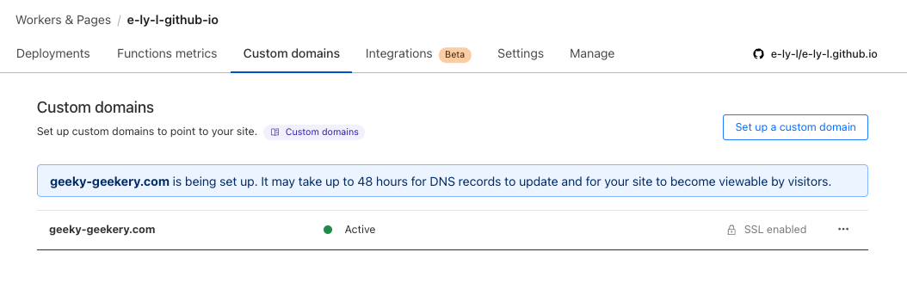
We can add subdomains that redirect to the website.  
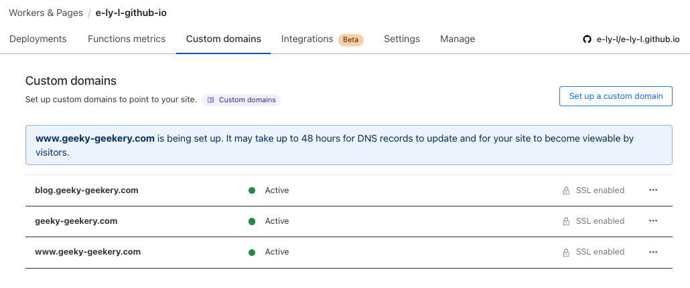

### Web Analytics

Not done yet. By using Cloudflare Domains to connect the website, we can use the built-in Web Analytics. Go to Analytics & Logs > Web Analytics and choose the right domain.  
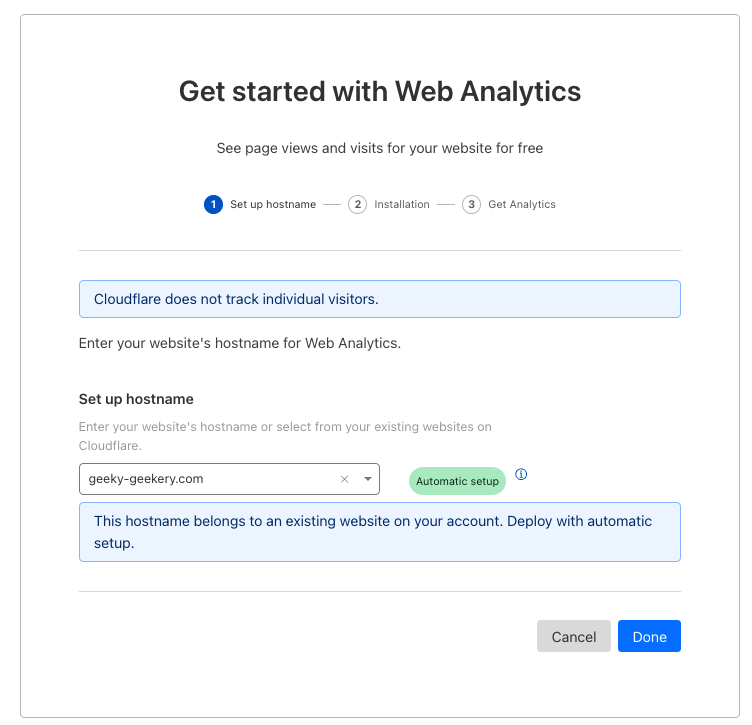
Got it. Very simple huh?  
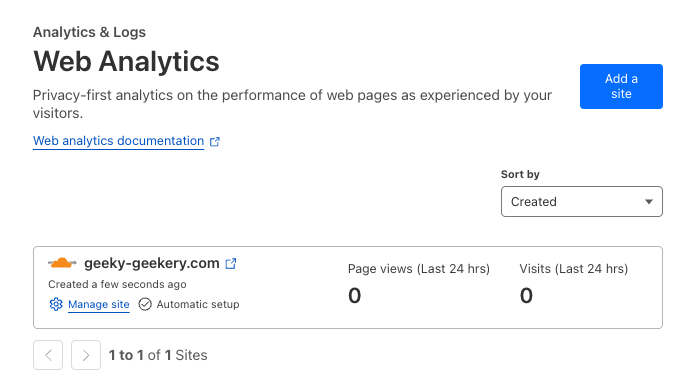

### Google Search Console

Now, let’s register our website on Google Search Console for better SEO. You’ll need a Google account for this. My account is in German, so sorry for the following screenshots.  
To explain briefly, we add the property to register the website. There are two ways to register: by domain or URL. If you choose the domain option and your domain registrar is Cloudflare, the steps will look like this…  
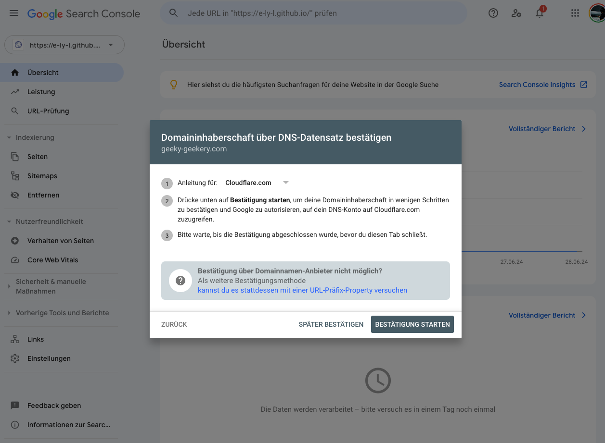
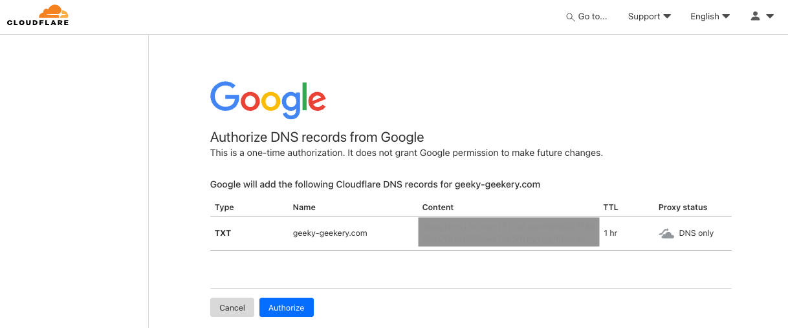
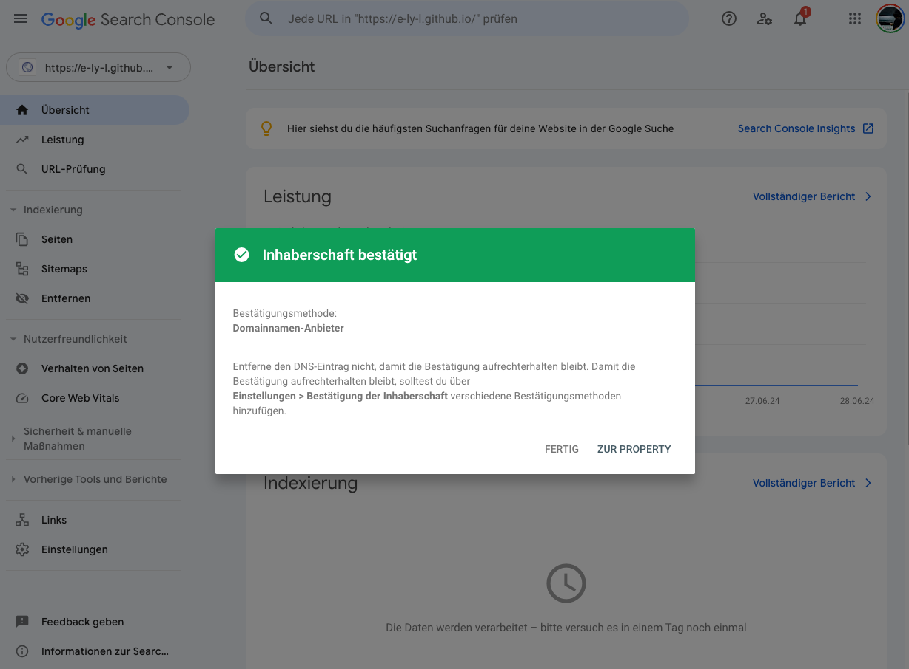
That's all! Happy Hosting!

P.S: After publishing the blog on CloudFlare Pages with a custom domain, I started getting some unknown visitors! It looks like a real website now!  
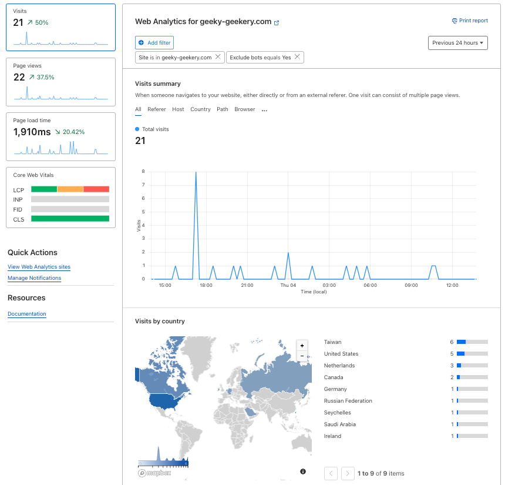

## Digression

### Provided Prices of Domain Registrators

- gandi.net : $17.75 ( renews at $23.99)
- AWS Route 53 : $14
- GoDaddy : $15.58 ( 3yrs bundle )
- Cloudflare Domains : $9.77 ( renews at $9.77 )
- Namecheap : $10.28 ( renews at $13.98 )
- Squarespace : $12

### Cloudflare R2

I chose Cloudflare partly because of the price but also for other services I wanted to try, such as Website Analytics mentioned above and Cloudflare R2 (similar to AWS S3), which offers a free tier sufficient for early blogging. A [pal](https://sspai.com/post/90170) seems to be using this service smoothly.
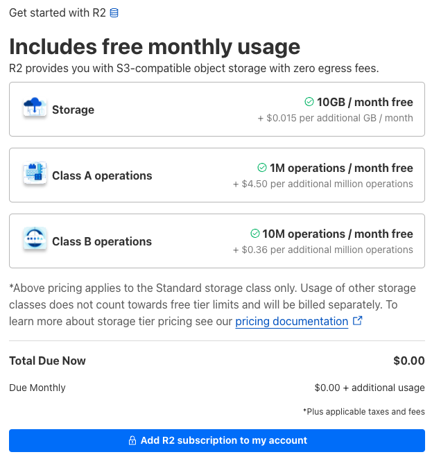

## References

- [Google Search Console 教學：使用與設定指南](https://www.yesharris.com/search-console/search-console-intro/)
  - Most detailed Google Search Console explanation
- [从零开始搭建你的免费图床系统 （Cloudflare R2 + WebP Cloud + PicGo）](https://sspai.com/post/90170)
  - How to upload and optimize images on Cloudflare R2 with PicGo
