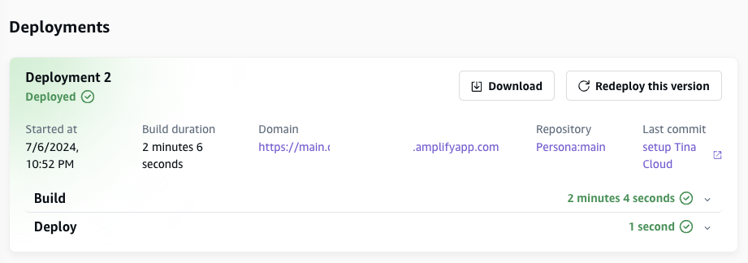

+++
title = "Create a Personal Webpage with Astro & TinaCMS"
description = ""
summary = ""
date = 2024-07-13T11:30:00+08:00
slug = "astro-with-tinacms"
tags = ["Personal Page", "Astro", "TinaCMS", "Tina Cloud", "AWS Amplify"]
categories = ["implement"]
+++

When I was thinking about my personal webpage as creator. I choose Nextjs plus TinaCMS as my tech stack. However I didn’t find the suitable theme or template about that.  
If I have choice, I don’t want everything from scratch. So at that moment, I felt a little frustrated. Until I discussed with my Frontend Engineer friend and he recommended me using Astro, the alternative of Nextjs. And I truly found the template built with Astro and TinaCMS.  
In this post, I will show how to set up a basic repository with the tech stack Astro and TinaCMS and host it on AWS with a custom domain.  
I will write another post to comprehensively demonstrate why I think Astro plus CMS might be almost the best way for a creator.

## Tech Stack

### Astro

Regarding SSR frameworks, for now, Next.js is like the champion, then Astro is like the challenger. I considered Next.js first, but some configurations are too complicated for me. Life is short, I choose ~~Python~~ Astro.

### TinaCMS

Since I’m comfortable posting on my tech blog using VSCode, it doesn’t mean I’m equally comfortable doing the same on my personal website. So initially, I tried to search for some technology to easily build an admin page to manage all content. There's so many other alternatives of TinaCMS. I choose TinaCMS for 3 main reasons.

1. Simple enough
2. Provide both Cloud & Self-hosted
3. Every content will be backed up on GitHub

And its logo is so cute


> See that cute alpaca?

### AWS

Just because I bought my personal domain on AWS Route 53 for a while, I can imagine I will migrate the hosting to another platform in the future. Actually I’m pretty sure GCP Firebase is the better choice, but since I use Firebase for my daily job and side projects with my partner, I want to try a different stack. So, that’s okay for now on AWS.

## Let's code

Firstly, I will create a new repository with Astro CLI tools, then integrate with TinaCMS. Then deploy on AWS using AWS Amplify and configure custom domain.

### Setup Repository

Now, create a repository using the Astro CLI tool, and select the ‘Use blog template’ option to obtain sample templates for sample data integration with CMS later.

```bash
npm create astro@latest <new_site_name>
```


Then install tinaCMS.

```bash
cd <new_site_name>
npx @tinacms/cli@latest init

```


Now, we need to modify `package.json` to run Astro and tinaCMS at the same time.

```json
// package.json
  "scripts": {
    "dev": "tinacms dev -c \"astro dev\" --noTelemetry",
    "start": "tinacms dev -c \"astro dev\" --noTelemetry",
    "build": "tinacms build --noTelemetry && astro build",
    "preview": "astro preview",
    "astro": "astro"
  },

```

Then run `npm run dev` , and there should also run a admin page on `<local_host_url>/admin` like following.


If we visit the admin page and see nothing, that’s normal because we have not yet provided the content schema to TinaCMS.

```typescript
// tina/config.ts
import { defineConfig } from "tinacms";

// Your hosting provider likely exposes this as an environment variable
const branch = process.env.HEAD || process.env.VERCEL_GIT_COMMIT_REF || "main";

export default defineConfig({
  branch,
  clientId: null, // Get this from tina.io
  token: null, // Get this from tina.io
  build: {
    outputFolder: "admin",
    publicFolder: "public",
  },
  media: {
    tina: {
      mediaRoot: "images",
      publicFolder: "public",
    },
  },
  schema: {
    collections: [
      {
        name: "blog",
        label: "Blog Posts",
        path: "src/content/blog",
        fields: [
          {
            type: "string",
            name: "title",
            label: "Title",
            isTitle: true,
            required: true,
          },
          {
            type: "string",
            name: "description",
            label: "Description",
            required: true,
          },
          {
            type: "datetime",
            name: "pubDate",
            label: "Date Published",
            required: true,
          },
          {
            type: "image",
            name: "heroImage",
            label: "Hero Image",
          },
          {
            type: "rich-text",
            name: "body",
            label: "Body",
            isBody: true,
          },
        ],
      },
    ],
  },
});
```

After defining the content schema in the TinaCMS configuration file, we can view the sample data provided by the Astro blog template.  

If we add content on the admin page, it will also appear on the personal page.


### Sign up Tina Cloud

This step is to access the admin page after deployment. We need an authorized account and domain to edit content on the admin page.  
First, we nee to sign up a account on [Tina Cloud](https://app.tina.io/). Then connect to Git repository and specify the custom domain.  


After completing the project configuration, fill out `clientId` and `token (Content)` in `tina/config.ts`. After deployment, we can access the admin page using a Tina Cloud account.

### Deploy with AWS Amplify

AWS Amplify is an easy CI/CD tool for deployment. While we can actually follow [the Astro documentation](https://docs.astro.build/en/guides/deploy/aws/), I prefer to directly operate on AWS dashboard with GUI.

So we choose Amplify in AWS dashboard. Choose the Git repository, deployment branch and build setting then deploy.  
P.S.: Check which region you are in; for example, I chose ap-northeast-1 (Tokyo).




### Set Custom Domain

Go to Hosting > Custom domains, set up the custom domain we owned. I already bought this domain on AWS Route 53 for a while, so I don't demonstrate how to buy domain on AWS.


### TinaCMS Admin Page

After everything is set up and completed, we can view the page on our custom domain on the internet. This includes the TinaCMS Admin Page, so when we visit `https://<custom_domain>/admin/` , we can modify content after login as Tina Cloud account. If it doesn’t work, check if Tina Cloud Authorization is already set or not.  


In the future, we could review commit changes like following after every content change on the admin page.  


## References

- [TinaCMS & Astro](https://docs.astro.build/de/guides/cms/tina-cms/)
  - The Astro Documentation guides how to integrate TinaCMS into Astro
- [Quick-and-useful: A DIY, self-hosted Linktree and Linkinbio clone with Astro and TinaCMS](https://darko.io/posts/linktree-and-linkinbio-clone-with-astro-and-tinacms)
  - Show how to build a homemade LinkTree by Astro & TinaCMS
