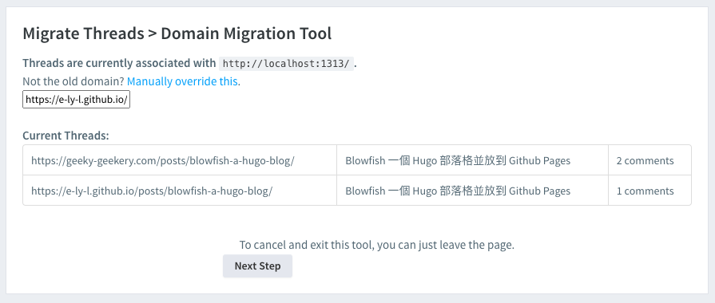

+++
title = "Install Disqus on Hugo Blog"
description = ""
summary = ""
date = 2024-07-26T20:30:00+08:00
slug = "install-disqus-on-hugo-blog"
tags = ["Tech Blog","Hugo", "blowfish", "disqus"]
categories = ["implement"]
+++

## Preface

What is the most important thing for a tech blog besides posting?
It's **interaction** to me.

Why? Because if we don't interact with our readers, we won't know what they think about our post. But also the implementation of the post might be wrong or simply not working to someone else.

So, after I set up my blog with Hugo, I decided to install Disqus to interact with my readers.

## What is Disqus?

[Disqus](https://disqus.com/) is a blog comment hosting service for websites and online communities that uses a networked platform. The company's platform includes various features, such as social integration, social networking, user profiles, spam and moderation tools, analytics, email notifications, and mobile commenting.

Easy to say, we can have two roles to use Disqus: **Commenter** and **Site Host**. As as commenter, we can review all our comments and manage them in the Disqus dashboard. As a site host, we can configure the settings of the comment section on our site. Especially, if we want to migrate our comments from another platform, Disqus provides a migration tool.

### Disqus Alternatives

There are many alternatives to Disqus, such as [Commento](https://commento.io/), [Hyvor Talk](https://talk.hyvor.com/). but also open source stack, e.g. [utterances](https://utteranc.es/), [giscus](https://giscus.app/). However, Disqus is the most popular and widely used. Especially, if we want to use a free service, Disqus is the best choice.

## Create a Disqus Account and Site

Let's just skip account creation. I don't think we need a guide for that.

After we create an account, we will be redirected to the dashboard. We can just click the `installing Disqus` and follow the instructions. Then it will ask us which platform we are using. For the time I write this post, Hugo is not listed in the platform list. Don't worry, we can just choose the `Universal Code` and copy the code. Then we can paste it into our blog. Of course, we could configure settings first.

## Install Disqus on Hugo Blog

Because I set up my Hugo blog with blowfish theme, so I have 2 ways to install Disqus on my blog.

### 1. Blowfish Partials

Based on [documentation](https://blowfish.page/docs/partials/#comments), we just need to create `layouts/partials/comments.html` file and paste the universal code here. The code should looke like following.

```html
<div id="disqus_thread"></div>
<script>
  (function () {
    var d = document,
      s = d.createElement("script");
    s.src = "https://<your-short-code>.disqus.com/embed.js";
    s.setAttribute("data-timestamp", +new Date());
    (d.head || d.body).appendChild(s);
  })();
</script>
<noscript>
  Please enable JavaScript to view the
  <a href="https://disqus.com/?ref_noscript"> comments powered by Disqus. </a>
</noscript>
```

Then configure the settings in the `config/_default/params.toml` file for global use.

```toml
[article]
  showComments = true
```

Or we can just configure it in the front matter of the post, then it will override the global settings. The file path might be like `content/posts/_index.md`.

```markdown
---
cascade:
  showComments: true
---
```

### 2. Hugo Content Managment

[Documentation](https://gohugo.io/content-management/comments/) on Hugo public site also provides a way to install Disqus. First we need to configure the `hugo.toml` file.

```toml
[services]
  [services.disqus]
    shortname = 'your-disqus-shortname'
```

Then we could put the following code in every post's front matter.

```markdown
{{ template "_internal/disqus.html" . }}
```

If we want to set a template for the comment section, we can copy the template file under the theme folder, path should be `themes/<your-theme>/layouts/_default/single.html` and paste this to our root folder, path should be `layouts/_default/single.html`. Then we can put the commenting section into proper place in the template file. Blowfish theme follows same rule, so if we unsatisfied with the default commenting section, we can just copy the file `themes/blowfish/layouts/_default/single.html` to `layouts/_default/single.html` and modify it.

```html
{{ define "main" }}
<article>
  <header>
    <h1>{{ .Title }}</h1>
    <p>{{ .Date.Format "2006-01-02" }}</p>
  </header>
  <section>{{ .Content }}</section>
  <footer>{{ template "_internal/disqus.html" . }}</footer>
</article>
{{ end }}
```

## Bonus: Disqus Migration Between Different Domains

I set up my tech blog on Github Pages ([this post](../blowfish-a-hugo-blog/)) then I changed into Cloudflare Pages with custom domain ([this post](../publish-a-static-website-on-cloudflare-pages/)). Initially, I thought it could share the same comment platform even though different domains. Indeed, it's right with the way I didn't imagine. They are seperated. That means the comment on Github domain won't show on Cloudflare domain. So, if I want to migrate the comments, I need to use the migration tool in the Disqus dashboard.

### Disqus Migration Tool

It's on the dashboard and click the `Moderation` then `Migration Tools`. There are 3 ways to migrate, they are `Domain Migration Tool`, `URL Map`, `Redirect Crawler`

In this case, I just need to use the `Domain Migration Tool`. First step, we need to fill the old domain. Second step, we need to fill the new domain. Then we can click the `Confirm Migration` button. After that, we could move the comments from the old domain to the new domain.




Noted that the migration tool manually moves and the comments will be removed from the old domain. And if there are new comments on the old domain, they won't be automatically moved to the new domain, so we need to do it again. Initially, I thought it could be automatically moved, but it's not. So I need to give up my old domain and move all comments to the new domain.

## References

- [Hugo 加入 Disqus 整合性留言管理系統](https://coreychen71.github.io/posts/2019-05/hugoadddisqus/)
  - detailed guide on how to install Disqus on Hugo blog
