+++
title = "How to post facebook programmingly?"
description = ""
summary = ""
date = 2024-09-26T23:45:00+08:00
slug = "facebook-posting-api"
tags = ["facebook graph api"]
categories = ["implement"]
+++

Recenyly, my side project needs to post to facebook page automatically. I found that facebook provides a Graph API to do this. Here is the steps to post to facebook page programmingly.

We need to create an app in facebook developer console, add permissons in Graph API  ,get the token and use the token to post to facebook page.


## Create App
First, we need to create an app in facebook developer console. We can go to [Meta for Developers](https://developers.facebook.com/) and click `My Apps` to create a new app.

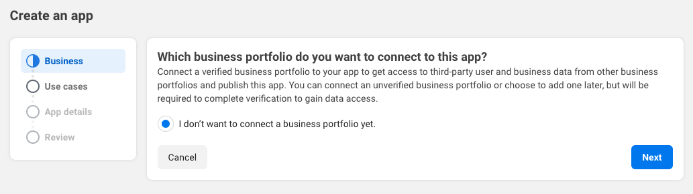
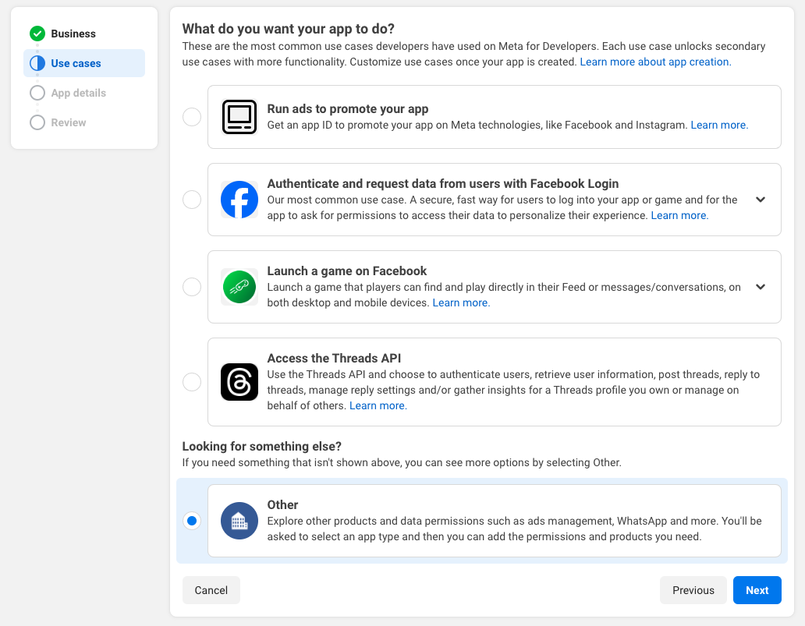
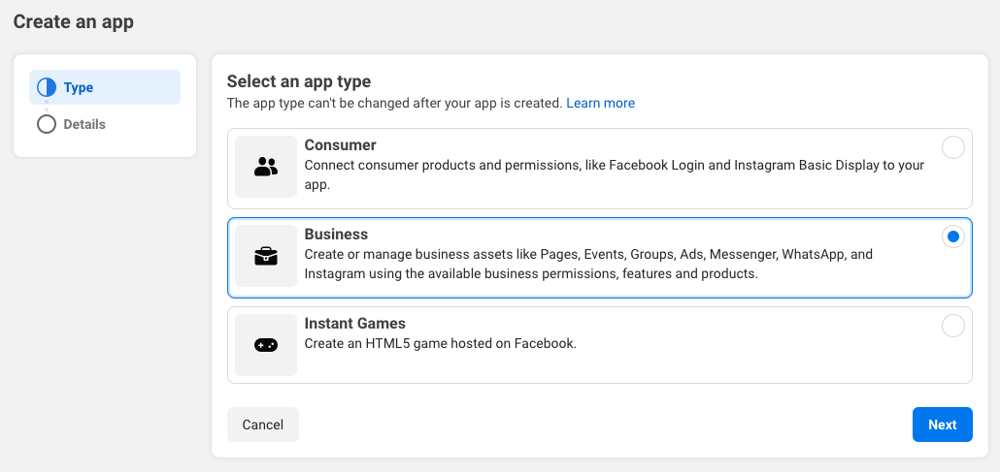
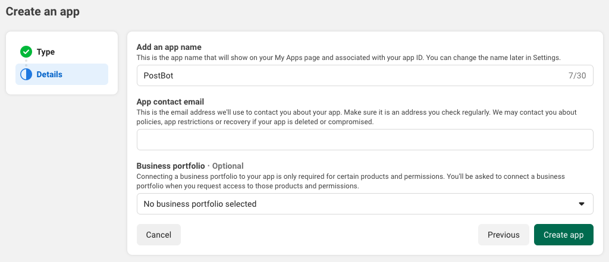

## Graph API permissions
After creating the app, we need to add the permission to the app. We can go to `Tools` > `Graph API Explorer` and add the permission we need.
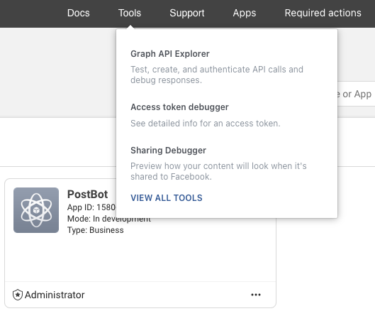
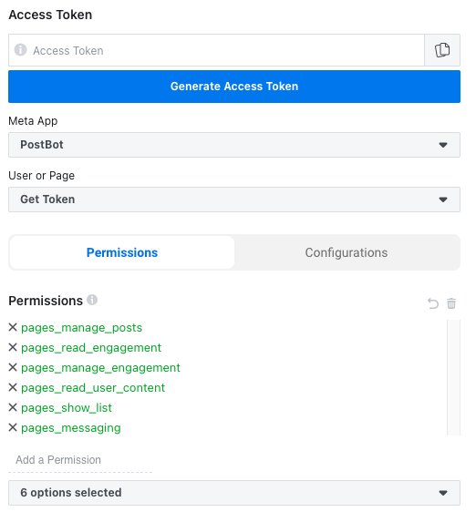
If we want to post and comment to facebook page, we need to add the following permissions.
- `pages_show_list`
- `pages_messaging`
- `pages_manage_posts`
- `pages_read_engagement`
- `pages_manage_engagement`
- `pages_read_user_content`


## Token
After adding the permission, we can get the token in `Access Token` tab. Noted, it is only short-term token. We need to exchange it to long-term token and page token.

### Short-term User Token
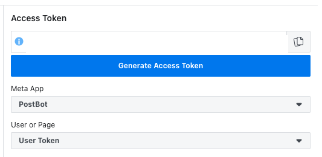

### Long-ten User Token
We can find the `App ID` and `App Secret` in `Settings` > `Basic`. Addition the short-term access token which we just got ,we can use the following API to exchange the long-term user token.

```http
# HTTP GET METHOD
https://graph.facebook.com/oauth/access_token
	?grant_type=fb_exchange_token
	&client_id=<APP_ID>
	&client_secret=<APP_SECRET>
	&fb_exchange_token=<SHORT_TERM_USER_TOKEN>

```
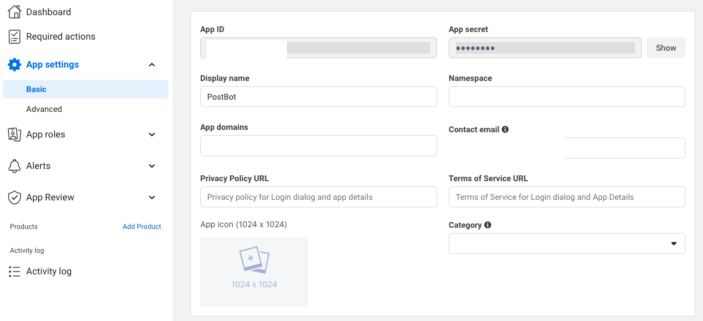

```json
// response
{
  "access_token":"...", // long-term user token
  "token_type":"bearer",
  "expires_in":5183501 // seconds
}
```

### Page Token
Final step of token is to exchange the page token. We can use the following API to exchange the page token. We can find the `Page ID` in facebook page `About` > `Page Transparency` > `Page ID`.

```http
# HTTP GET METHOD
https://graph.facebook.com/<PAGE_ID>
	?fields=access_token
	&access_token=<LONG_TERM_USER_TOKEN>
```
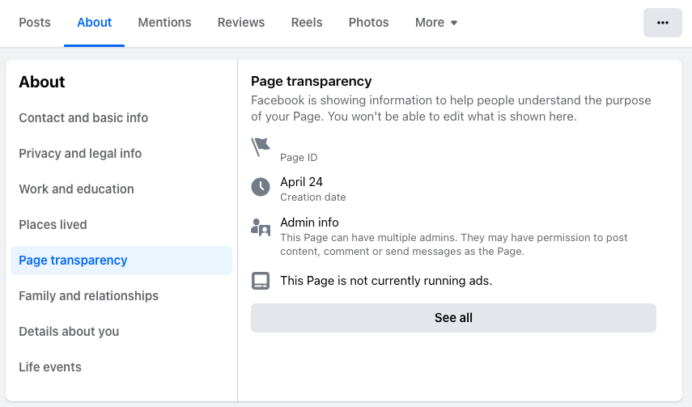


## Live Mode
Not finish yet. Till last step, we can only use the app in development mode. In development mode, we can also post and comment programmatically. But the post and comment are only visible to the app developer.

When we want to switch to live mode, we need to provide the privacy policy URL. We can use the following website to generate the privacy policy URL.

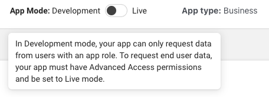
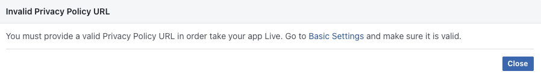

I use [Free Privacy Policy Generator](https://www.freeprivacypolicy.com/free-privacy-policy-generator/) to generate the privacy policy page and duplicate it to my webpage. It provide the privacy policy URL, we can use it to switch to live mode.

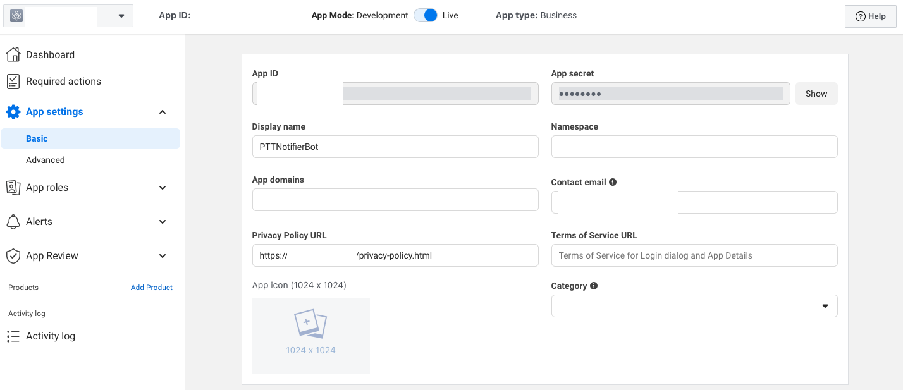

## Facebook Post API
After everything is ready, we can use the following API to post and comment to facebook page.

### Post
```http
# HTTP POST METHOD
https://graph.facebook.com/<PAGE_ID>/feed
  ?message=<POST_CONTENT>
  &access_token=<PAGE_TOKEN>
```
```json
// response
{
    "id": <POST_ID>
}
```
###
### Comment
```http
# HTTP POST METHOD
https://graph.facebook.com/<POST_ID>/comments
  ?message=<COMMENT_CONTENT>
  &access_token=<PAGE_TOKEN>

```
```json
// response
{
    "id": <COMMENT_ID>
}
```

---
## References
- [Facebook粉專自動發文以及留言API](https://ithelp.ithome.com.tw/articles/10313722)
  - I basically follow this article to post to facebook page.
- [Facebook Graph Api 教學，1秒將臉書貼文轉官網](https://gingerdesign.com.tw/facebook-graph-api-tutorial/)
  - More detail about facebook graph api.
